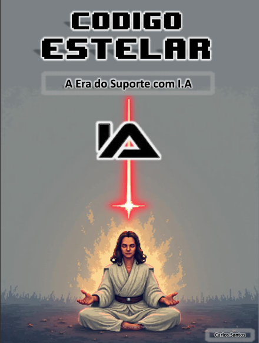
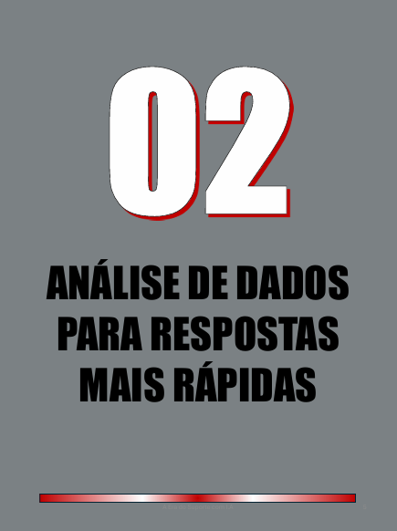
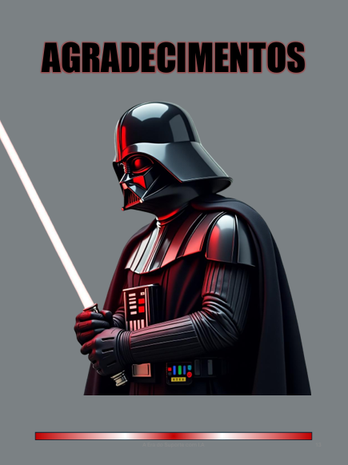

    

-------

# Projeto EBOOK Gerado por I.A.s

> ℹ️ **NOTE:** Este é o repositório desenvolvido durante o curso no qual fui aluno na plataforma da [DIO](https://dio.me)

Projeto com o objetivo de gerar um ebook digital com as facilidades das ferramentas de IA. todos os prompts
seguem abaixo.

<a href="https://github.com/oCarlosantos/prompts-recipe-to-create-a-ebook/blob/main/output/ebook_suporte_e_IA.pdf" title="View PDF now"> 📕Clique aqui para ler</a>

## 💻 Tecnologias utilizadas no projeto

- [ChatGPT](https://chat.openai.com/) 
- [MidJourney](https://www.midjourney.com/app/)
- [PowerPoint](https://www.microsoft.com/en/microsoft-365/powerpoint)

## 🧠 Prompts

ChatGPT：

|   Ação   | prompt                                                                                                                                                                                                                                                                         |
| :------: | ------------------------------------------------------------------------------------------------------------------------------------------------------------------------------------------------------------------------------------------------------------------------------ |
|  título  | Crie um título de um ebook sobre a importância da I.A. no dia-a-dia do Suporte ao Usuário, o, o ebookk é do nicho de Suporte ao Usuário e o subnicho é de programação, o título deve ser épico e curto, e tenha uma temática de star wars no título, me liste 5 variações de títulos                                                        |
| conteúdo | Faça um texto para ebook , com foco em suporte, listando as principais atividades e exemplos que se pode aplicar a I.A com o Suporte ao Usuário, com exemplos 
{REGRAS} Explique sempre de uma maneira simples Deixe o texto enxuto, Sempre traga exemplos de código em contextos reais , sempre deixe um título sugestivo por tópico |

Midjourney：

|  Ação  | prompt                                                                                 |
| :----: | -------------------------------------------------------------------------------------- |
| título | A jedi in meditation pose, with your blue lightsaber floating, pixel art style --v 5.1 |

## ✨ Features

- Conteúdo gerado via ChatGPT
- Imagens geradas via MidJourney

## 📚 Materiais

- Imagens utilizadas em `assets`
- ebook gerado durante as aulas em `output`

## 🛠️ Instruções de execução

Utilize os prompts acima nas ferramentas sugeridas para gerar o material base e utilize uma ferramenta de edição de documentos como power point, libreoffice , indesign para diagramação.

## 👨‍💻 Expert

  <strong>Carlos Santos</strong> 
  <a href="https://github.com/oCarlosantos" target="_blank">GitHub</a>&nbsp;|&nbsp;
  <a href="https://www.linkedin.com/in/carlos-andré-santos-289aa224a/" target="_blank">LinkedIn</a>&nbsp;|&nbsp;
  <a href="https://www.instagram.com/carlosantosk8/" target="_blank">Instagram</a>

---

⌨️ por [Carlos Santos](https://github.com/oCarlosantos)
